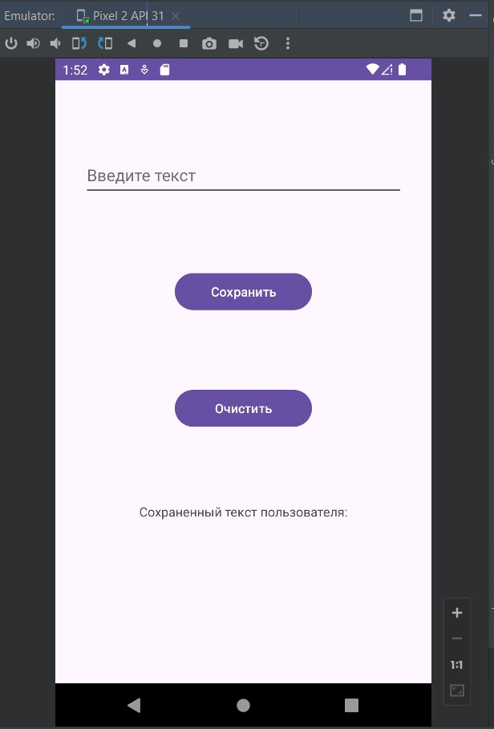
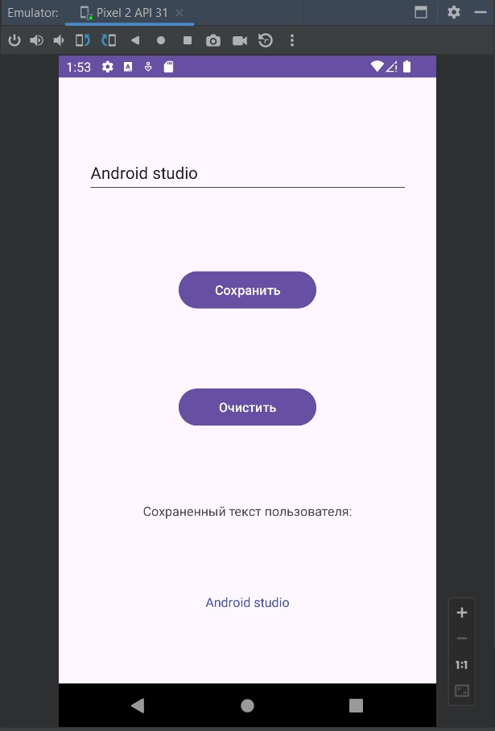

# Урок 11. Основы хранения данных

Цели практической работы
Применить знания:
- по сохранению данных в памяти устройства;
- по созданию и применению паттерна «Репозиторий».

Что нужно сделать
Создадим одноэкранное приложение, которое позволяет вводить данные и записывать их в SharedPreference, 
а также отображать введённые данные даже после повторного открытия приложения.
1. Создайте экран произвольной вёрстки, аналогичный тому, который вы разрабатывали 
ранее со спикером, содержащий:
- поле для ввода текста (EditText);
- кнопку c текстом «Сохранить» (Button);
- кнопку с текстом «Очистить» (Button);
- текстовое поле (TextView).
2. Создайте класс Repository, который будет содержать несколько методов:
getDataFromSharedPreference(): String? — будет доставать значение из SharedPreference;
getDataFromLocalVariable(): String? — будет доставать значение, возвращать значение локальной переменной;
saveText(text: String) — будет записывать значения и в SharedPreference, и в локальную переменную.
clearText() — будет очищать значение и в SharedPreference, и в локальной переменной.
getText(): String — будет доставать значение из источников: сначала попытается взять 
значение локальной переменной; если оно null, то попытаемся взять значение из SharedPreference.
3. Создайте экземпляр класса репозитория в своём fragment/activity.
4. После нажатия кнопки «Сохранить» — возьмите текстовое значение из EditText и передайте 
его в метод saveText(text: String).
5. При нажатии кнопки «Очистить» — очистите значение в репозитории через метод clearText().
6. При открытии приложения или при изменении значения текст в TextView должен меняться.

=======================================================================================

## Демонстрация решения:

